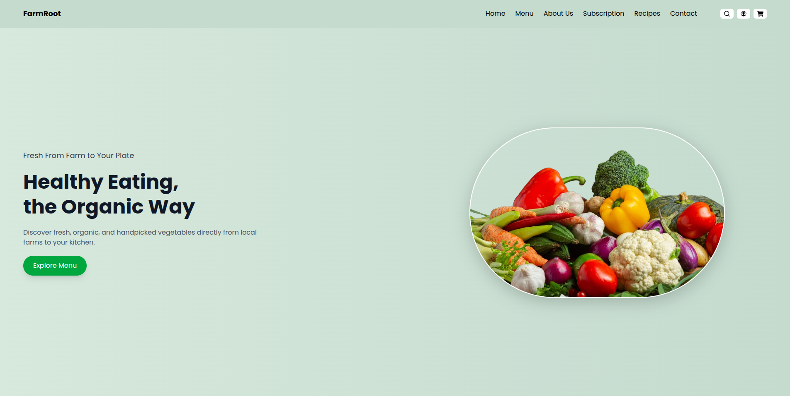
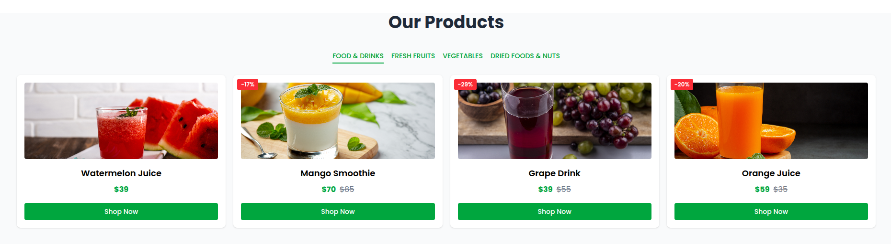
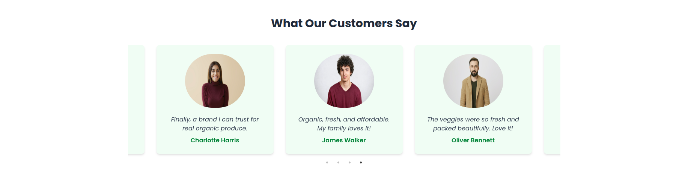

# Organic Food Website 🌱

Welcome to the **Organic Food Website**! This project is a modern, responsive website built with React and Vite, designed to showcase organic products and promote sustainable living.

---

## 🚀 Features

- **Responsive Design**: Optimized for all devices (mobile, tablet, desktop).
- **Dynamic Components**: Built with reusable React components.
- **Fast Performance**: Powered by Vite for lightning-fast builds and development.
- **Organic Focus**: Promotes healthy living and supports local farmers.

---

## 📸 Screenshots

### Home Page


### Products Section


### Testimonials Section


---

## 🛠️ Technologies Used

- **React**: Frontend framework for building UI components.
- **Vite**: Development environment for fast builds and HMR.
- **Tailwind CSS**: Utility-first CSS framework for styling.
- **React Slick**: Carousel library for sliders.
- **React Icons**: Icon library for social media and other icons.

---

## 📂 Project Structure

```plaintext
src/
├── assets/            # Static assets like images and fonts
├── components/        # Reusable React components
├── pages/             # Page components for routing
├── App.jsx            # Main app component
├── main.jsx           # Entry point for React
└── styles.css         # Global styles
```

---

## ⚙️ Setup and Installation

To get started with the project, follow these steps:

1. **Clone the repository**:
   ```bash
   git clone https://github.com/yourusername/organic-food-website.git
   cd organic-food-website
   ```

2. **Install dependencies**:
   ```bash
   npm install
   ```

3. **Run the development server**:
   ```bash
   npm run dev
   ```

4. **Open your browser** and navigate to `http://localhost:3000` to see the website in action.

---

## 📝 Contributing

We welcome contributions to the Organic Food Website! To contribute, please follow these steps:

1. **Fork the repository** on GitHub.
2. **Create a new branch** for your feature or bug fix:
   ```bash
   git checkout -b feature/your-feature-name
   ```
3. **Make your changes** and commit them with a clear message.
4. **Push to your forked repository**:
   ```bash
   git push origin feature/your-feature-name
   ```
5. **Create a pull request** on GitHub to merge your changes into the main repository.

---

## 📄 License

This project is licensed under the MIT License.

---

## 👥 Acknowledgments

- **React** and **Vite** teams for their amazing work on these tools.
- **Tailwind CSS** team for the utility-first CSS framework.
- All the open-source contributors and libraries that made this project possible.

---

Feel free to explore, and happy coding! 🌱
